<!--
╔══════════════════════════════════════════════════════════════════════════════════╗
║       ANMOL RATHOD · PREMIUM CYBERPUNK GITHUB PROFILE README                   ║
║       AI Security · LLM Security · Cybersecurity · OSINT                       ║
╚══════════════════════════════════════════════════════════════════════════════════╝
-->

<!-- ══════════════════════ HERO BANNER ══════════════════════ -->

  

<!-- ══════════════════════ ANIMATED TYPING ══════════════════════ -->

  

<!-- ══════════════════════ BADGE ROW ══════════════════════ -->

  
  &nbsp;
  
  &nbsp;
  
  &nbsp;
  

<!-- ══════════════════════ SOCIAL BADGES ══════════════════════ -->

  
  &nbsp;
  
  &nbsp;
  

 

 

<!-- ══════════════════════ TERMINAL: ABOUT ME ══════════════════════ -->

  

 

 

<!-- ══════════════════════ TECH DASHBOARD ══════════════════════ -->

  

 

<!-- ─── AI & Machine Learning ─── -->

  

<table align="center" width="96%" cellpadding="0" cellspacing="0" border="0">
  <tr>
    <td align="center" width="7%" valign="middle">
       
      <b>AI &amp; ML</b>
    </td>
    <td width="93%" valign="middle" align="center">
      
      
      
      
      
      
      
      
      
      
      
      
    </td>
  </tr>
</table>

 

<!-- ─── AI Security ─── -->
<table align="center" width="96%" cellpadding="0" cellspacing="0" border="0">
  <tr>
    <td align="center" width="7%" valign="middle">
       
      <b>AI Security</b>
    </td>
    <td width="93%" valign="middle" align="center">
      
      
      
      
      
      
      
      
      
    </td>
  </tr>
</table>

 

<!-- ─── Cyber Security & SOC ─── -->
<table align="center" width="96%" cellpadding="0" cellspacing="0" border="0">
  <tr>
    <td align="center" width="7%" valign="middle">
       
      <b>Cyber &amp; SOC</b>
    </td>
    <td width="93%" valign="middle" align="center">
      
      
      
      
      
      
      
      
      
      
      
      
      
      
      
    </td>
  </tr>
</table>

 

<!-- ─── OSINT & OPSEC ─── -->
<table align="center" width="96%" cellpadding="0" cellspacing="0" border="0">
  <tr>
    <td align="center" width="7%" valign="middle">
       
      <b>OSINT &amp; OPSEC</b>
    </td>
    <td width="93%" valign="middle" align="center">
      
      
      
      
      
      
      
      
      
      
      
      
      
    </td>
  </tr>
</table>

 

<!-- ─── Development & Environments ─── -->
<table align="center" width="96%" cellpadding="0" cellspacing="0" border="0">
  <tr>
    <td align="center" width="7%" valign="middle">
       
      <b>Dev Stack</b>
    </td>
    <td width="93%" valign="middle" align="center">
      
      
      
      
      
      
      
      
      
      
      
      
      
      
    </td>
  </tr>
</table>

 

 

<!-- ══════════════════════ GITHUB TELEMETRY ══════════════════════ -->

  

 

<!-- Stats Row -->

  
  &nbsp;&nbsp;
  

<!-- Streak -->

  

<!-- Trophies -->

  

<!-- Activity Graph -->

  

<!-- Snake -->
<h3 align="center">
  
</h3>

  

 

 

<!-- ══════════════════════ MISSION TIMELINE ══════════════════════ -->

  

 

  

 

 

<!-- ══════════════════════ QUOTE ══════════════════════ -->

  

 

<!-- ══════════════════════ FOOTER ══════════════════════ -->

  

<!-- ══ Hidden: Thanks for visiting my profile! Ctrl+U for source 👀 ══ -->
