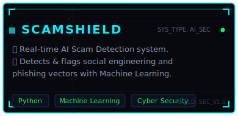
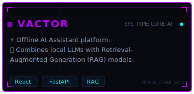
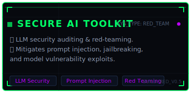
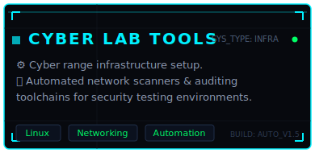

<!--
========================================================================
 ANMOL RATHOD - PREMIUM CYBERPUNK GITHUB PROFILE README
========================================================================
-->

  <!-- Animated Hero Banner -->
  

  <!-- Animated Typing Text -->
  

<!-- Profile views badge -->

  

 

  <!-- Cyber Terminal About Me -->
  

 

  <!-- Social Badges Panel -->
  
  &nbsp;&nbsp;&nbsp;&nbsp;
  
  &nbsp;&nbsp;&nbsp;&nbsp;
  

 

  

 

<!-- ==================== TECH DASHBOARD ==================== -->
<h2 align="center">⚡ [ TECH DASHBOARD ] ⚡</h2>

 

<table align="center" width="100%" border="0" cellpadding="5">
  <tr>
    <td width="50%" valign="top">
      <h3>🤖 [AI &amp; MACHINE LEARNING]</h3>
      
      
      
      
      
      
      
      
      
      
    </td>
    <td width="50%" valign="top">
      <h3>🛡️ [AI SECURITY]</h3>
      
      
      
      
      
      
      
      
    </td>
  </tr>
  <tr>
    <td width="50%" valign="top">
      <h3>📡 [CYBER SECURITY]</h3>
      
      
      
      
      
      
      
      
      
      
    </td>
    <td width="50%" valign="top">
      <h3>🔍 [OSINT &amp; RECON]</h3>
      
      
      
      
      
      
      
    </td>
  </tr>
  <tr>
    <td width="50%" valign="top">
      <h3>🕶️ [OPSEC &amp; PRIVACY]</h3>
      
      
      
      
      
      
    </td>
    <td width="50%" valign="top">
      <h3>🏢 [SOC OPERATIONS]</h3>
      
      
      
      
      
      
    </td>
  </tr>
  <tr>
    <td width="50%" valign="top">
      <h3>💻 [DEVELOPMENT]</h3>
      
      
      
      
      
      
      
      
      
      
      
      
      
    </td>
    <td width="50%" valign="top">
      <h3>💿 [OPERATING SYSTEMS]</h3>
      
      
      
      
        
      <h3>🌐 [LANGUAGES]</h3>
      
      
      
    </td>
  </tr>
</table>

 

  

 

<!-- ==================== GITHUB DASHBOARD ==================== -->
<h2 align="center">📊 [ GITHUB TELEMETRY ] 📊</h2>

 

<!-- Stats and Languages Row -->

  
  &nbsp;&nbsp;
  

<!-- Streak Counter -->

  

<!-- GitHub Profile Trophies -->

  

<!-- Contribution Activity Graph -->

  

<!-- Contribution Snake Game -->
<h3 align="center">🐍 [ CONTRIBUTION GRID SHIELD ] 🐍</h3>

  <!-- The output branch file path generated by the snake.yml action -->
  

 

  

 

<!-- ==================== FEATURED PROJECTS ==================== -->
<h2 align="center">🚀 [ FEATURED PROJECTS ] 🚀</h2>

 

<!-- 2x2 Responsive Project Dashboard -->
<table align="center" border="0" cellpadding="0" cellspacing="0">
  <tr>
    <td align="center" style="padding: 10px;">
      
    </td>
    <td align="center" style="padding: 10px;">
      
    </td>
  </tr>
  <tr>
    <td align="center" style="padding: 10px;">
      
    </td>
    <td align="center" style="padding: 10px;">
      
    </td>
  </tr>
</table>

 

  

 

<!-- ==================== CURRENT MISSION ==================== -->
<h2 align="center">🎯 [ TARGET TIMELINE / MISSION ] 🎯</h2>

 

  <!-- Interactive-looking Roadmap -->
  

 

  <!-- Footer Graphic -->
  

